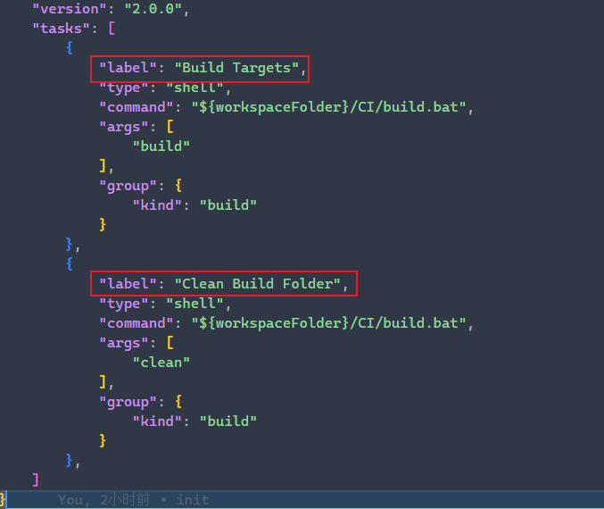
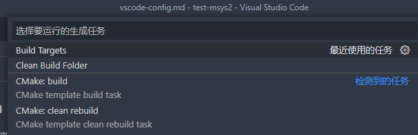

### .vscode/settings.json

### .vscode/launch.json

### .vscode/tasks.json

#### 为什么要创建tasks.json文件？

背景：在开发过程中，经常会存在一些重复的步骤。比如说生成/编译/运行等等。为了提高工作效率，对于常用的重复动作，可以统一的抽象为一个task。

所以需要将多个步骤的任务，编写一个脚本，然后通过task的方式运行脚本。

#### 解读 tasks.json 文件

> 文件生成一般是通过 [终端]->[配置任务...]
>
> tasks.json 文件中可以存在多个label

- "label" 属性是此task的名字，在launch.json中可以作为一个步骤进行运行
- "group" 属性一般只需要设置 "kind" 属性: "build"
- "command" 属性一般是运行的命令
- "args" 属性数组 只command可以使用的参数，比如 `ls` 的 `-al` 之类的

#### "type" 属性与什么有关呢？

自定义的type主要存在两种：`shell` 和 `process`

shell 是运行在 `bash/cmd/PowerShell` 等系统的外壳上的。

process 类似可执行文件一样，可以运行在后台。

#### 如何运行 task 任务？

通过 ctrl + shift + B 打开 Build 任务栏

